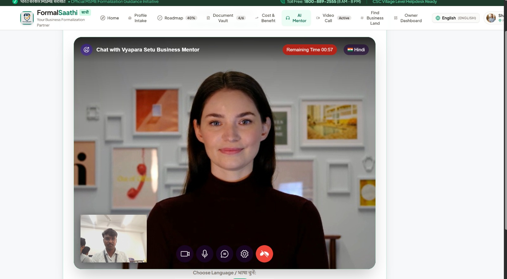

<p align="center">
  
</p>

<h1 align="center">Vyapara Setu</h1>

<p align="center">
  <strong>AI-powered business formalization, location discovery, matching, and agent connectivity for entrepreneurs in India.</strong>
</p>

<p align="center">
  <a href="#features">Features</a> •
  <a href="#architecture">Architecture</a> •
  <a href="#tech-stack">Tech Stack</a> •
  <a href="#getting-started">Getting Started</a> •
  <a href="#environment-variables">Environment Variables</a> •
  <a href="#api-endpoints">API Endpoints</a> •
  <a href="#roadmap">Roadmap</a>
</p>

<p align="center">
  
  
  
</p>

---

## Overview

**Vyapara Setu** ("Business Bridge") is a digital platform that helps entrepreneurs move from a raw business idea, or an informal business, toward a structured and formal business journey.

It brings together an **AI Business Mentor**, **formalization guidance**, **location discovery**, **opportunity matching**, and **direct agent connectivity** into a single, multilingual experience.

```
Business Idea
     │
     ▼
AI Business Mentor
     │
     ▼
Formalization & Compliance Guidance
     │
     ▼
Location Discovery
     │
     ▼
Business / Property Matching
     │
     ▼
Agent Connection
     │
     ▼
Live Video Interaction
```

---

## Features

### 🤖 AI Business Mentor
An AI mentor built for Indian entrepreneurs, offering practical guidance on:
- Udyam / MSME registration
- GST applicability
- FSSAI for food businesses
- Shop & Establishment requirements
- Trade and municipal permissions
- Business documentation
- Location and premises considerations
- Next-step business planning

Available in **English, Telugu, Hindi, and Tamil**.

### 🏢 Business Formalization
Guides entrepreneurs through a structured formalization journey based on:
- Business type
- State and city
- Premises type
- Business scale
- Food / non-food activity
- Applicable registrations and permissions

### 🗺️ Location Discovery
Helps entrepreneurs explore suitable locations for their business requirements.

### 🎯 Matching
Matches business requirements against relevant listings and opportunities.

### 👥 Agent Connectivity
Connects entrepreneurs with property or business agents in real time.

### 📹 Live Communication
Real-time human-to-human communication via LiveKit, including camera, microphone, remote video, chat, and screen sharing.

### 🌐 Multilingual Experience
Designed around multilingual access so entrepreneurs can interact in the language they're most comfortable with.

---

## AI & Voice Stack

```
User
 │
 ├── Text  → Groq LLM
 │
 └── Voice
      │
      ▼
   Sarvam STT
      │
      ▼
   Groq LLM
      │
      ▼
   Sarvam TTS
      │
      ▼
   Voice Response
```

The AI Mentor also connects to a **Beyond Presence** managed conversational agent for the avatar experience.

---

## Architecture

```
┌───────────────────────────────┐
│         React Frontend        │
│                                │
│  AI Mentor | Map | Matching   │
│  Formalize | Agent | Admin    │
└───────────────┬────────────────┘
                │
                ▼
┌───────────────────────────────┐
│         FastAPI Backend        │
│                                │
│  AI | Voice | LiveKit | APIs  │
└───────┬───────────────┬────────┘
        │               │
        ▼               ▼
      Groq            Sarvam
        │             STT / TTS
        │
        ▼
  Beyond Presence
    Managed Agent
        │
        ▼
     LiveKit
```

---

## Tech Stack

**Frontend**
- React
- TypeScript
- Vite
- Tailwind CSS
- Lucide Icons

**Backend**
- Python
- FastAPI
- Uvicorn

**AI / Voice**
- Groq LLM
- Sarvam AI
- Beyond Presence

**Real-Time Communication**
- LiveKit

**Tooling**
- Git / GitHub
- ESLint
- Prettier

---

## Project Structure

```
VyaparaSetu/
├── backend/
│   ├── routes/
│   ├── services/
│   ├── main.py
│   ├── requirements.txt
│   └── .env.example
│
├── src/
│   ├── components/
│   ├── data/
│   ├── utils/
│   ├── App.tsx
│   └── main.tsx
│
├── public/
├── docs/
│   └── assets/
│       └── vyapara-setu.png
├── package.json
├── vite.config.ts
└── README.md
```

> Keep `backend/venv/`, `node_modules/`, and secret `.env` files out of version control.

---

## Getting Started

### Prerequisites
- Node.js 18+
- Python 3.11+
- Git

### 1. Clone the repository
```bash
git clone https://github.com/Adithya-charan/VyaparaSetu.git
cd VyaparaSetu
```

### 2. Install frontend dependencies
```bash
npm install
```

### 3. Set up the backend environment
```bash
cd backend
python -m venv venv
venv\Scripts\activate
pip install -r requirements.txt
```

### 4. Configure environment variables
Create `backend/.env` using `.env.example` as a template:

```env
GROQ_API_KEY=your_groq_api_key
GROQ_MODEL=openai/gpt-oss-20b
SARVAM_API_KEY=your_sarvam_api_key
LIVEKIT_API_KEY=your_livekit_api_key
LIVEKIT_API_SECRET=your_livekit_api_secret
LIVEKIT_URL=wss://your-livekit-server
BEYOND_PRESENCE_API_KEY=your_beyond_presence_api_key
BEYOND_PRESENCE_AGENT_ID=your_beyond_presence_agent_id
```

> Never commit real API keys or secrets.

### 5. Start the backend
From the project root:
```bash
backend\venv\Scripts\python.exe -m uvicorn backend.main:app --reload --host 0.0.0.0 --port 8001
```
- Backend: `http://localhost:8001`
- Swagger docs: `http://localhost:8001/docs`

### 6. Start the frontend
In another terminal:
```bash
npm run dev
```
Open the local URL printed by Vite.

---

## API Endpoints

| Method | Endpoint | Purpose |
|--------|----------|---------|
| GET | `/api/livekit/token` | Generate a LiveKit participant token |
| POST | `/api/ai/chat` | Text-based AI mentor response |
| POST | `/api/ai/chat-voice` | Voice → STT → LLM → TTS pipeline |
| POST | `/api/sarvam/process-voice` | Sarvam voice processing |
| POST | `/api/beyond-presence/session` | Beyond Presence integration endpoint |

> Verify provider-specific production contracts before deployment; local development routes may evolve.

---

## Security

- Never commit secrets to GitHub.
- Add environment files to `.gitignore`:

```gitignore
.env
.env.*
backend/.env
backend/venv/
node_modules/
dist/
__pycache__/
*.pyc
```

- API credentials must remain server-side only.

---

## Development Workflow

```bash
git status
git add .
git commit -m "Describe your change"
git push origin main
```

Before pushing, verify that no secret files or virtual-environment files are tracked.

---


## Demo Scenario

> *"I want to start a bakery in Vijayawada."*

An end-to-end demo can walk through:
1. AI Mentor understanding the business idea
2. India-focused formalization guidance
3. Location discovery
4. Matching suitable opportunities
5. Connecting the entrepreneur with an agent
6. Live communication with the agent

---

## Screenshots

### AI Business Mentor — Video Call


<!-- Add more screenshots as they become available -->
<!--
### Location & Map


### Agent Connection

-->

---

## Contributing

1. Fork the repository
2. Create a feature branch
3. Make your changes
4. Test locally
5. Open a pull request with a clear description

---

## License

Add your project license here before public release.

---

<p align="center">
  <strong>Vyapara Setu</strong> — Building a simpler digital bridge from business idea to business opportunity.
</p>

<p align="center">Built for entrepreneurs in India 🇮🇳</p>
